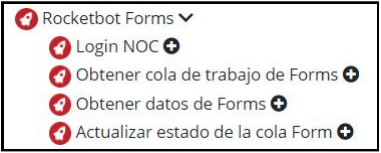
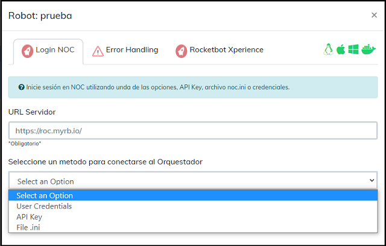
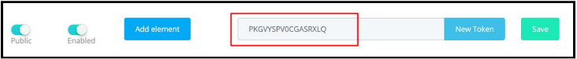
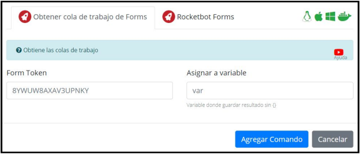
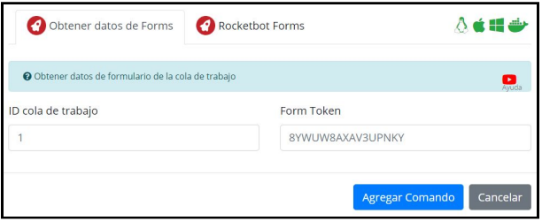
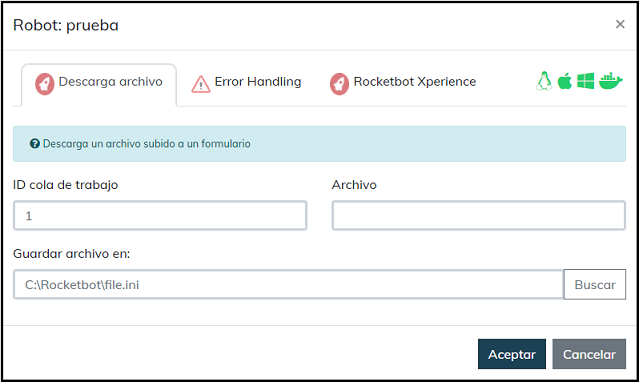
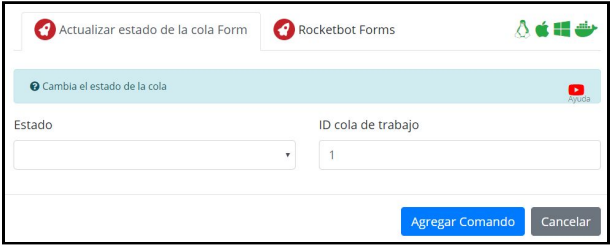
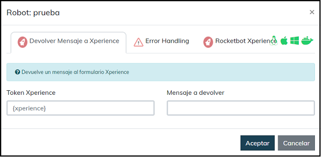

## Como usar este modulo

Con este módulo podemos obtener las colas de trabajo y los datos de los
formularios creados en R.O.C, los cuales posteriormente son llenados por los
usuarios.
Ir al menú “Mods” y abrir el módulo “Rocketbot Forms”

1. Login NOC  
Para realizar el login hacia el Orquestador es necesario lo siguiente:  
● URL del servidor : Indicar la URL del servidor R.O.C  
● Seleccionar una opcion: Indicar la opcion que se utilizara para la conexion las cuales pueden ser mediante las credenciales del usuario, API KEY o mediante el archivo noc.ini.

2. Obtener cola de trabajo de Forms  
Este comando obtiene las colas de trabajo que se encuentran en R.O.C  
● Form Token: Token del formulario que se genera al momento de crear el Form.  
  
● Asignar a variable: Nombre de variable donde se almacenarán el o los ids
de las colas de trabajo encontradas.  

3. Obtener datos de Forms  
Con este comando podemos obtener los datos del formulario, los ids creados para los elementos en el Form de R.O.C deben coincidir con el nombre de las variables en Rocketbot, con esto automáticamente se llenarán.  
● ID cola de trabajo: ID de la cola de trabajo que queremos leer.  
● Form Token: Token asociado al formulario.

4. Descargar desde archivo 
Descarga un archivo subido a un formulario  
● ID cola de trabajo: Cola de trabajo del formulario  
● Nombre: Nombre del archivo que se va a descargar  
● Guardar archivo en: Ruta donde se almacenara el archivo

5. Actualizar estado de cola Form 
Con este comando podemos actualizar el estado de la cola de trabajo en el R.O.C, indicando como realizada o no.  
● Estado: Estado de la cola (Done, Undone).  
● ID cola de trabajo: ID de la cola de trabajo a actualizar.

6. Devolver mensaje a Xperience  
Devuelve un mensaje a Xperience especificando el Token y el mensaje a devolver

## How to use this module

With this module we can obtain the work queues and the data of the
forms created in R.O.C, which are subsequently filled out by the
users.
Go to the “Mods” menu and open the “Rocketbot Forms” module

1. Login NOC
To login to the Orchestrator, the following is necessary: ​​ 
● Server URL : Indicate the URL of the R.O.C server  
● Select an option: Indicate the option that will be used for the connection, which can be through the user's credentials, API KEY or through the noc.ini file.

2. Get work queue from Forms
This command gets the job queues found in R.O.C  
● Form Token: Token of the form that is generated when the Form is created.  
  
● Assign to variable: Variable name where the id(s) will be stored.
of the work queues found.  

3. Get data from Forms  
With this command we can obtain the form data, the ids created for the elements in the R.O.C Form must match the name of the variables in Rocketbot, with this they will automatically be filled.  
● Work Queue ID: ID of the work queue we want to read.  
● Form Token: Token associated with the form.

4. Download from file 
Download a file uploaded to a form  
● Work queue ID: Work queue of the form  
● Name: Name of the file to be downloaded  
● Save file in: Path where the file will be stored

5. Update Queue Status Form 
With this command we can update the status of the work queue in the R.O.C, indicating as done or not.  
● State: State of the queue (Done, Undone).  
● Work queue ID: ID of the work queue to update.

6. Return message to Xperience  
Returns a message to Xperience specifying the Token and the message to return

